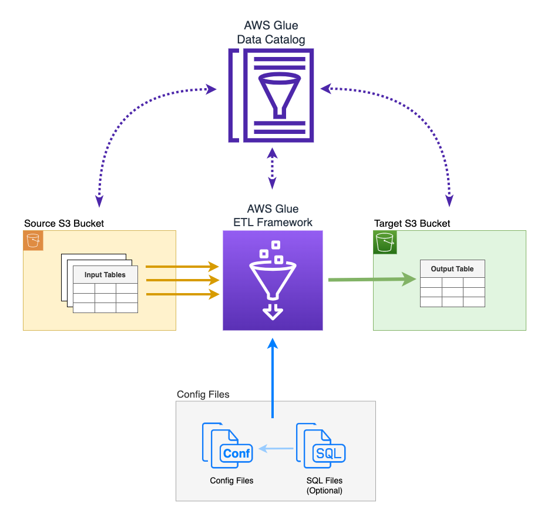

# Config Driven ETL Framework for AWS Glue

A lightweight and config driven ETL (extract, transform, load) framework to perform ETL operations on data lakes using AWS Glue


## Features

- A config driven framework, reads from a YAML file
- Extacts data from data lake
- Runs transformations using Spark-SQL
- Loads the processed data back to data lake
- Can execute external Python Scripts
  
<br>

## ETL Architecture for AWS Glue



#

<br>


## Config File

Config file is a YAML file where you can provide config parameter values to execute the ETL operation


|Key|Sub Key|Description|Type|Valid Values|Default|Example|
|--|--|--|--|--|--|--|
|job|||Required||||
||name|Name of the job|Optional||||
||type|Type of the job|Required|spark-sql<br>pyhon-script|||
||<nobr>spark-config</nobr>|Optional Spark Config Items|Optional|||spark-config:<br>- spark.executor.memory: 4g<br>- spark.driver.memory: 4g|
|variables|||Required||||
||<em>pipeline_name</em>|<nobr>Put the name of your pipeline<br><em>* You can add multiple pipeline names if the config is shared<em>|Required|<nobr>Config value should be in Python Dictionary format||my_pipeline: {"variable1":"value1", "variable2":"value2"}|
|input_tables|||Required||||
||-name<br><em>YAML array</em>|* The name of the table to read from<br>* If source is S3 It's the Spark view name<br>* Use same name in the SQL|Required||||
||source|Source type of the table|Required|* <nobr>S3 : Direct access to S3 locations<br>* GDC : Access source tables using Glue Data Catalog<br>* JDBC : Access source tables using JDBC||S3|
||database|The database to read from|<nobr>Required if source is GDC or JDBC||||
||location|The physical location of the table<br><em>* <nobr>Can include variables provided in pipeline variables</em>|Required if source is S3|||<nobr>s3://data-lake-bucket/{value1}/{value2}table_name/</nobr>|
||format|File format when the source is S3|Optional|parquet<br>csv<br>json<br>orc<br>avro|parquet|parquet|
||format_options|Formatting options for the source files|Optional|https://docs.aws.amazon.com/glue/latest/dg/aws-glue-programming-etl-format.html||{"quoteChar": '"',<br> "withHeader": True,<br>"separator": ",",<br>"optimizePerformance":False}|
|output_table|||Required||||
||name|Name of the output table<br><em>Can include {pipeline_name} variable|Required|||patient_{pipeline_name}|
||target|Target type of the output table|Required|S3<br>GDC||S3|
||database|The database to write to|Required when target is GDC or JDBC||||
||schema|The db schema to write to|Required when target is JDBC||||
||location|The physical location of the table<br><em>Can include variables provided in pipeline variables|Required when target is S3|||s3://data-lake-bucket/output-folder/my_table_{pipeline_name}/|
||governed|Specifies if the output table is a governed table in GDC|Optional<br><em>Can be used only when target is GDC|yes||yes|
||format|File format when the target is S3|Optional|parquet<br>csv<br>json<br>orc<br>avro|parquet|parquet|
||format_options|Formatting options for the source files|Optional|https://docs.aws.amazon.com/glue/latest/dg/aws-glue-programming-etl-format.html||{"quoteChar": '"',<br> "withHeader": 
||refresh|Table data refresh type|Optional|full<br>incremental|||
||coalesce|Controls the number of files produced in the output table|Optional|Any integer value||10|
||repartition|Controls the number of files produced in the output table|Optional|Any integer value||10|
||partition_keys|Table partition keys|Optional|||"column1,column2"|
|sql||* A single SQL SELECT statement in YAML multiline format<br>* Can include variables provided in pipeline variables|Optional|* Either sql or sql_file should be privided, not both<br>* If both are provided, sql would be used||\|<br>SELECT a.\*, b.*<br>FROM spark_table1 a<br>JOIN spark_table2 b ON b.column1 = b. column1|
|sql_file||* A SQL script file which contains a single SELECT statement<br>* Can include variables provided in pipeline variables|Optional|* Either sql or sql_file should be privided, not both<br>* If both are provided, sql would be used||s3://data-lake-bucket/etl-framefork/config/sql/my_query.sql|
|python_file||* A Python script file to be executed within the Glue job<br>* Can include variables provided in pipeline variables|Required when type.job is python-script|||s3://data-lake-bucket/etl- framefork/config/python/my_script.py|
#


<br>

 #### Usage Notes :
 - The framework can perform UPSERT on both non-partitioned or partitioned data lake tables.
 - You can read from one or many tables but write back to a single table
 
 #
<br>
<br>

# Example 1 
Pipeline Name = 2022_sales<br>
Job Type = spark-sql<br>
<br>
Input tables :<br>
<br>
&nbsp;&nbsp;&nbsp;sv_sales : <br>
&nbsp;&nbsp;&nbsp;&nbsp;&nbsp;&nbsp;Source = S3,<br>
&nbsp;&nbsp;&nbsp;&nbsp;&nbsp;&nbsp;Location = s3://data-lake-bucket/y2022/sales/ <br>
&nbsp;&nbsp;&nbsp;&nbsp;&nbsp;&nbsp;Format = Default (parquet)<br>

&nbsp;&nbsp;&nbsp;sv_region : Source = S3,<br>
&nbsp;&nbsp;&nbsp;&nbsp;&nbsp;&nbsp;Format = CSV,<br> 
&nbsp;&nbsp;&nbsp;&nbsp;&nbsp;&nbsp;Location = s3://data-lake-bucket/sales/region/ <br>

&nbsp;&nbsp;&nbsp;sv_customer : Source = S3,<br>
&nbsp;&nbsp;&nbsp;&nbsp;&nbsp;&nbsp;Source = S3,<br>
&nbsp;&nbsp;&nbsp;&nbsp;&nbsp;&nbsp;Location = s3://data-lake-bucket/sales/customer/<br>
&nbsp;&nbsp;&nbsp;&nbsp;&nbsp;&nbsp;Format = Default (parquet)<br>

<br>
Output table :<br>
&nbsp;&nbsp;&nbsp;sales_by_region,<br>
&nbsp;&nbsp;&nbsp;&nbsp;&nbsp;&nbsp;Target = S3,<br>
&nbsp;&nbsp;&nbsp;&nbsp;&nbsp;&nbsp;Location = s3://datalake-bucket/outputfolder/y2022/sales_by_region/
<br>
<br>
<br>

## Config File for Example 1
```
job:
    type: spark-sql

variables:
    sales_2021: {"datasource": "y2021", "area": "sales"}
    sales_2022: {"datasource": "y2021", "area": "sales"}

input_tables:
    - name: sv_sales
      source: s3
      location: s3://datalake-bucket/{datasource}/sales/ 
    - name: sv_region
      source: s3
      location: s3://data-lake-bucket/{area}/region/
      format: csv
      format_options: {
            "quoteChar": '"',
            "withHeader": True,
            "separator": ",",
            "optimizePerformance": False,
        }
   - name: sv_customer
      source: s3
      location: s3://data-lake-bucket/{area}/customer/

output_table:
    name: sales_by_region
    target: s3
    location: s3://datalake-bucket/outputfolder/{datasource}/sales_by_region/

sql: |
    SELECT r.region_id, sum(s.total_amount) as total_amount
    FROM sv_sales s
    JOIN sv_customer c
        ON c.customer_id = s.customer_id
    JOIN sv_region r
        ON r.region_id = c.region_id
```


#
<br>

# Example 2 
Pipeline Name = 2022_sales<br>
Job Type = spark-sql<br>
<br>
Input tables :<br>
<br>
&nbsp;&nbsp;&nbsp;sv_sales : <br>
&nbsp;&nbsp;&nbsp;&nbsp;&nbsp;&nbsp;Source = GDC<br>
&nbsp;&nbsp;&nbsp;&nbsp;&nbsp;&nbsp;Database = sales_2022 <br>

&nbsp;&nbsp;&nbsp;sv_region : Source = S3<br>
&nbsp;&nbsp;&nbsp;&nbsp;&nbsp;&nbsp;Source = GDC<br>
&nbsp;&nbsp;&nbsp;&nbsp;&nbsp;&nbsp;Database = common_db <br>

&nbsp;&nbsp;&nbsp;sv_customer : Source = S3<br>
&nbsp;&nbsp;&nbsp;&nbsp;&nbsp;&nbsp;Source = GDC<br>
&nbsp;&nbsp;&nbsp;&nbsp;&nbsp;&nbsp;Database = common_db <br>


<br>
Output table :<br>
&nbsp;&nbsp;&nbsp;sales_by_region<br>
&nbsp;&nbsp;&nbsp;&nbsp;&nbsp;&nbsp;Target = GDC<br>
&nbsp;&nbsp;&nbsp;&nbsp;&nbsp;&nbsp;Database = ML
<br>
<br>
<br>


## Config File for Example 2
```
job:
    type: spark-sql

variables:
    sales_2021: {"datasource": "y2021", "area": "sales"}
    sales_2022: {"datasource": "y2021", "area": "sales"}

input_tables:
    - name: sv_sales
      source: GDC
      database: sales_2022

    - name: sv_region
      source: GDC
      database: common_db

    - name: sv_customer
      source: GDC
      database: common_db
      
output_table:
    name: sales_by_region_{datasource}
    target: gdc
    database: common_db
sql_file: s3://datalake-bucket/config/sql/sales.sql
```